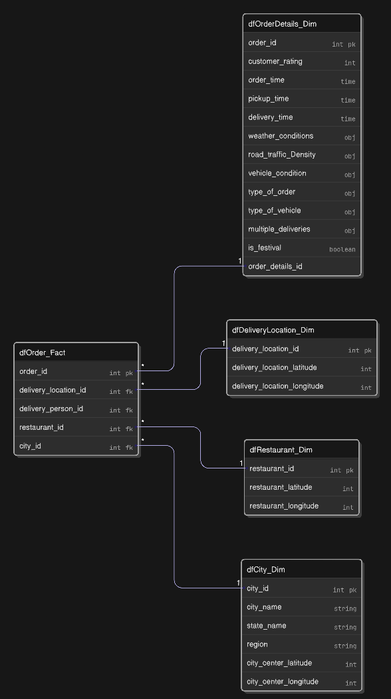

# 🚚 Network Food Delivery EDA & Insights

This repository performs an **Exploratory Data Analysis (EDA)** on a food delivery dataset, transforming it from a STAR schema based dataset; subsequently, turning data into actionable insights through data cleaning, reverse geocoding, and visualization.

## 🧐 Overview
- Transform raw, denormalized data into a structured **star schema** with clean fact and dimension tables.
- Enrich location data with **reverse geocoding** and map visualizations.
- Derive actionable insights and visualizations to improve delivery operations and customer satisfaction.

---

## 📦 Dataset
- Source: Zomato’s “Delivery Operations Analytics” dataset (40,000+ records).
- Contains:  
  – Restaurant and delivery locations  
  – Timestamps (`order` & `pickup` times)  
  – Delivery person details and vehicle info  
  – Traffic, weather, and festival context  
  – Delivery duration and customer rating  

---

## 🗂 Project Structure

## 🔍 Goals
- Clean and enrich dataset with city-level and regional labels
- Regional and territory level data reporting
- Business plan for improving CX

## 🛠 Tech Stack
- Python & Pandas – Data transformation and wrangling
- Geopy, Haversine – Reverse geocoding for city-level labelling
- Seaborn, Matplotlib – Charting and statistical graphics
- Folium – Interactive mapping
- Jupyter Notebooks

## 🌍 Regional Analysis

Using restaurant clustering and lat-long data, each city was mapped to one of the following operational regions:
- **South**
- **West & Central**
- **North & East**

This allowed region-wise benchmarking and operational performance comparison across India.

## 📊 Visualizations Included

- Box plots for delivery time and ratings by region
- Bar graphs for traffic impact and festival delays
- Heatmaps for regional demand
- Distance vs time scatter plots
- Correlation matrix for operational variables

## 🧩 Business Use Case

The findings from this project can help:
- Create a power BI dashboard to visualize this data and enable automated reporting.
- Create a Google sheets/Quip based tracker for territory-wise actionables each week.

## 📈 Future Work
- Analyze how delivery ratings are influenced by:
  - Road traffic density
  - Weather conditions
  - Holidays
  - Vehicle type and delivery personnel

## 📁 Folder Structure
- `data/` - Raw and processed datasets
- `notebooks/` - Main analysis Jupyter notebook
- `Assets/` - Asset files
