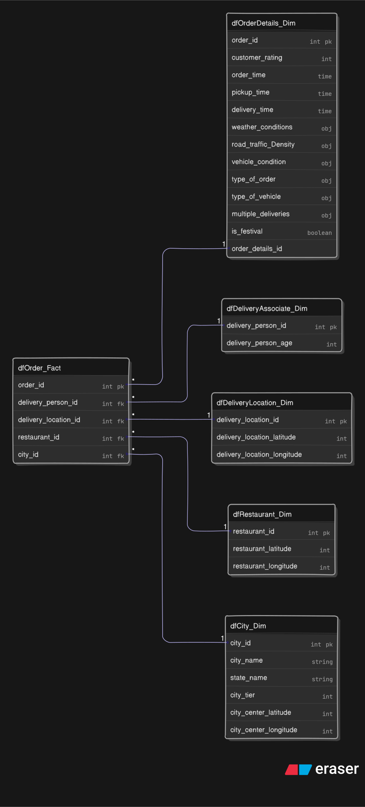

# 🚚 Network Food Delivery EDA & Insights

This repository performs an **Exploratory Data Analysis (EDA)** on a food delivery dataset, transforming it from a flat, highly-denormalized table into actionable insights through data cleaning, feature engineering, and visualization.

## 🧐 Overview
- Analyze real-world delivery records from multiple cities to understand driver behavior, restaurant hotspots, and operational bottlenecks.
- Transform raw, denormalized data into a structured **star schema** with clean fact and dimension tables.
- Enrich location data with **reverse geocoding** and map visualizations.
- Derive actionable insights and visualizations to improve delivery operations and customer satisfaction.

---

## 📦 Dataset
- Source: Zomato’s “Delivery Operations Analytics” dataset (40,000+ records).
- Contains:  
  – Restaurant and delivery locations  
  – Timestamps (`order` & `pickup` times)  
  – Delivery person details and vehicle info  
  – Traffic, weather, and festival context  
  – Delivery duration and customer rating  

---

## 🗂 Project Structure

## 🔍 Goals
- Clean and enrich dataset with city-level labels
- Analyze how delivery ratings are influenced by:
  - Road traffic density
  - Weather conditions
  - Holidays
  - Vehicle type and delivery personnel

## 🛠 Tech Stack
- Python & Pandas – Data transformation and wrangling
- Geopy, Haversine – Reverse geocoding for city-level labelling
- Seaborn, Matplotlib – Charting and statistical graphics
- Folium – Interactive mapping
- Jupyter Notebooks

## 📈 Future Work
- Add predictive models for delivery time or rating using ML.
- Integrate time-based dimensions: weekday, peak-hours, festivals.
- Expand the EDA to include cuisine types, pricing, and location clusters.

## 📁 Folder Structure
- `data/` - Raw and processed datasets
- `notebooks/` - Main analysis Jupyter notebook
- `Assets/` - Asset files
